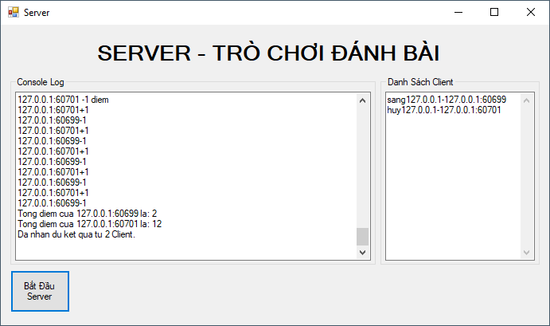

# Đề tài "Viết chương trình Client-Server cho trò chơi đánh bài"

## Nội dung thực hiện được :
- Tên Client đăng nhập không trùng lập (thực hiện đăng nhập được 2 client).
- Các tên đăng nhập có độ dài < 10 và không kí tự đặc biệt.
- Server gửi thông báo.
- Server chia k bài và k điểm.
- Client gửi bài mình chọn cho Server (nhấp vào hình và nhấn phím gửi).
- Server so sánh giá trị quân bài, tính điểm và gửi về Client.
- Client tính điểm.
- Server gửi kết quả và tổng số điểm.
- Client hiển thị kết quả lên màn hình.

## Một vài hình ảnh :

